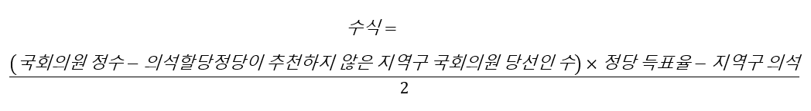
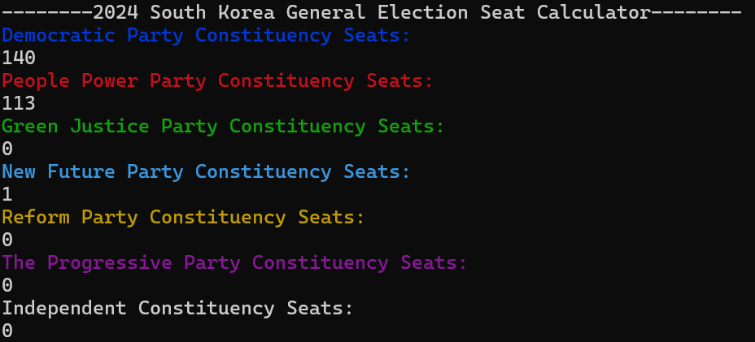
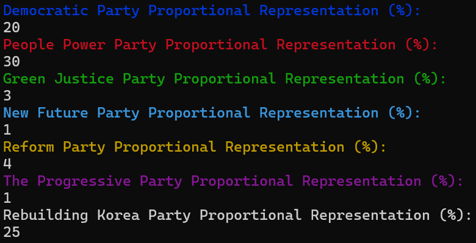
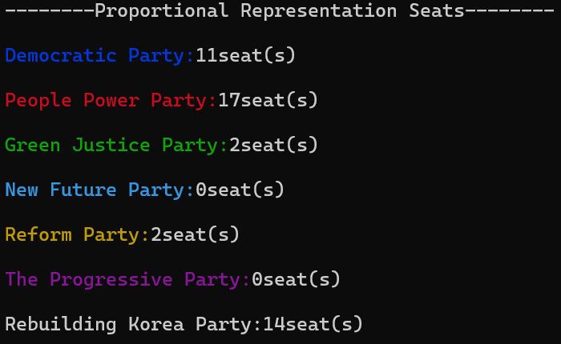

## 대한민국 제22대 국회의원 선거 준연동형 비례대표제 의석수 계산기

#### 비례대표제 의석수 계산기에 대하여

+ 기존의 병립형 선거제 대신에 제 21대 국회의원 선거부터 도입된 준연동형 비례대표제를 적용하여 각 당의 예상 비례의석수를 산출해내는 프로그램.
+ 각 정당의 예상 지역구 의석수, 비례득표율을 입력받아 비례대표 의석수를 계산함.
+ 2024년 3월 29일에 이 프로젝트를 시작함.

#### 개발환경

+ C++

#### 준연동형 비례대표제 의석 산출 방식

1) 지역구 의석이 5석 이상이거나, 비례대표 득표율이 3% 이상이 되면 의석 할당 정당 요건 충족.
2) 의석 할당 정당 요건을 충족하는 정당만을 대상으로 그 득표율이 100%가 되도록 재조정.
3) 연동 배분 의석수 산출.
   

  

4) 조정 의석수 산출.
   

  

5) 조정 의석수 소수점을 버림한 정수부가 1차 의석수.
6) 잔여 의석은 버림한 소수점이 큰 순서대로 배분한뒤 1차 의석수와 합한 것이 최종 비례대표 의석수.

#### 사용방법

  

1) 지역구 의석의 전체 합이 254석이 되도록 정당별로 값을 입력. 

  

2) 비례 득표율이 100%를 넘지 않도록 정당별로 값을 입력.

  

3) 정당별 비례 의석수 산출.

#### 기타

+ 프로그램 개발 과정: https://blog.naver.com/motorpoolpmcs/223400134071

#### 참조

+ 공직선거법 189조, 국가법령정보센터: https://www.law.go.kr/%EB%B2%95%EB%A0%B9/%EA%B3%B5%EC%A7%81%EC%84%A0%EA%B1%B0%EB%B2%95/%EC%A0%9C189%EC%A1%B0
+ 준연동형비례대표제, 그게 뭔가요?, 중앙선거관리위원회: https://www.nec.go.kr/site/nec/ex/bbs/View.do?cbIdx=1147&bcIdx=17218
+ 셈법 더 복잡해졌다…野 유지한다는 '준연동형 비례제' 뭐길래, 중앙일보: https://www.joongang.co.kr/article/25227020
